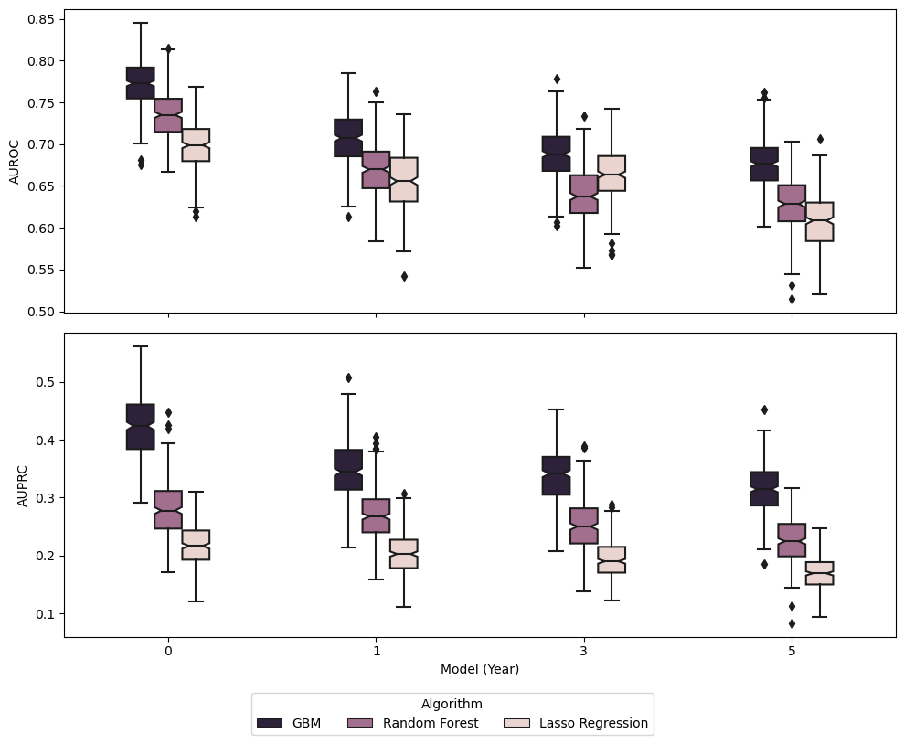
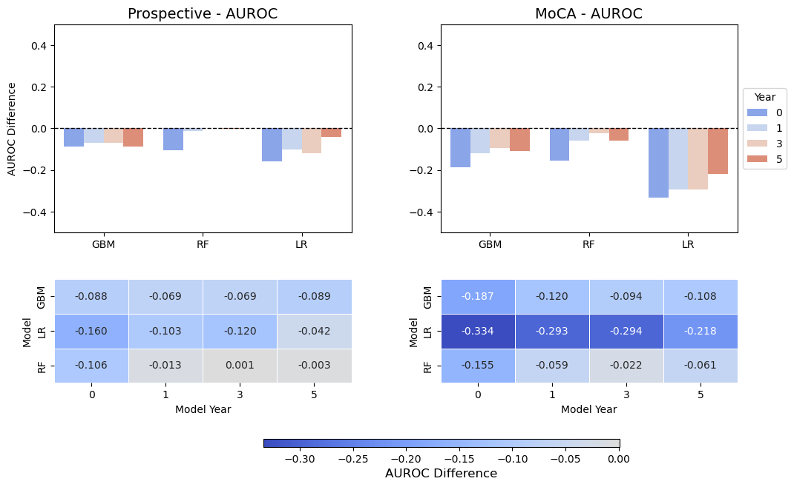
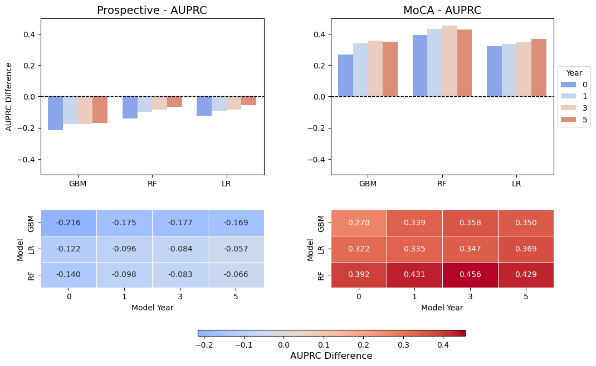
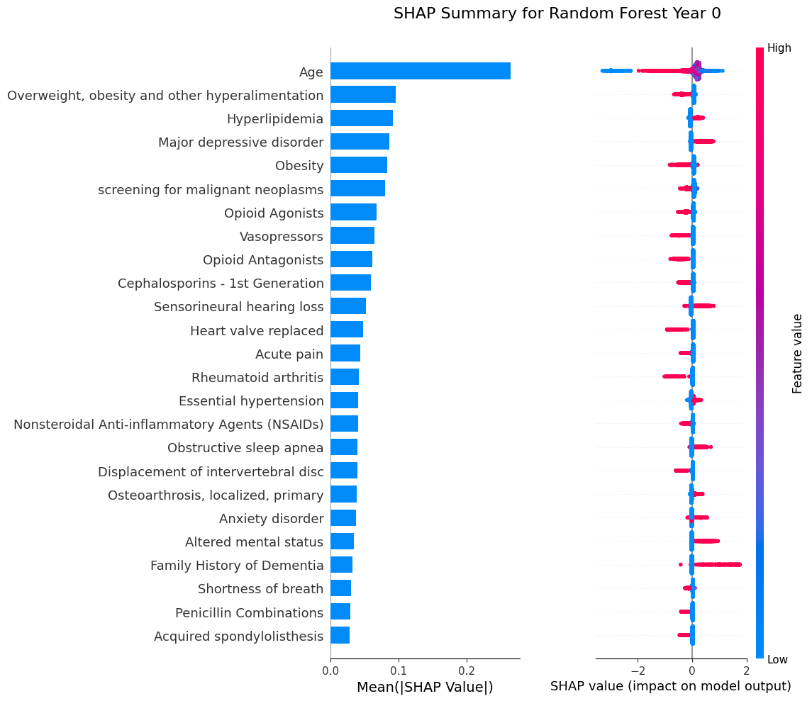
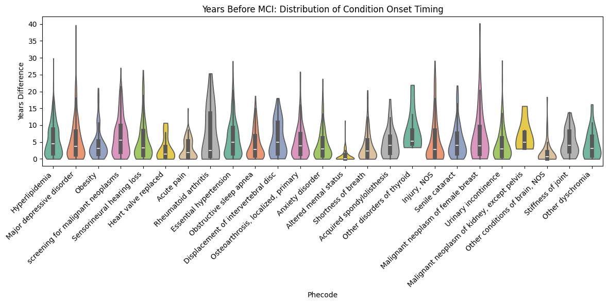

# Early Prediction of Mild Cognitive Impairment Using Structured EHR Data

Welcome to this project on predicting Mild Cognitive Impairment (MCI) using electronic health record (EHR) data from the University of Washington. This repository contains code and methodology for training machine learning models that predict patients at risk of MCI up to five years before clinical diagnosis. The goal is to enable earlier intervention and support primary care physicians with scalable, data-driven decision tools.

> **Note:** Due to the inclusion of protected health information (PHI), the raw dataset used in this study cannot be shared publicly.

---

## Data Source

The dataset was derived from the **UW Medicine Enterprise Data Warehouse (EDW)**, which aggregates patient records from multiple clinical sites. It includes longitudinal EHR data such as demographics, diagnoses, medication history, lab results, and cognitive assessments (e.g., MoCA scores). MCI cases were identified using diagnostic codes and chart review; controls were selected based on absence of cognitive impairment or related conditions.

Data access was approved under the University of Washington IRB STUDY00017102.

---

## Methods

We developed supervised machine learning models to predict MCI status at 0, 1, 3, and 5 years prior to diagnosis. The pipeline included:

- **Data Cleaning & Feature Engineering**:
  - One-hot encoding of clinical conditions, drug exposures, abnormal measurements, and social/family history
  - Mapping of ICD codes to PheWAS groups
  - Imputation of missing values
  - Time-windowed data extraction at -5, -3, -1, and 0 years from index

- **Models Used**:
  - Logistic Regression (LR)
  - Random Forest (RF)
  - Gradient Boosted Models (GBM)

We focused on these models because they balance **clinical interpretability, scalability, and feasibility**. Traditional ML approaches are easier to validate, deploy, and explain to clinicians compared to complex deep learning architectures, which often require larger datasets, specialized infrastructure, and longer training times. For initiatives like **DREAM Challenges** or healthcare system integration, starting with well-established, efficient models ensures results are both **transparent** and **practically implementable**—recognizing that not every problem needs deep learning to achieve impact.

- **Validation Strategy**:
  - 80/20 train/test split
  - 5-fold cross-validation for hyperparameter tuning
  - **External validation**: Models were tested on both prospective EHR data (to assess real-world generalizability) and a MoCA-based patient cohort (to compare against an independent, clinically accepted measure of cognition).
  - Model interpretability using SHAP values

---

## Results

### Model Performance for Gradient Boosting, LASSO, and Random Forest

### AUROC Scores

| Model               | 0 year          | 1 year          | 3 year          | 5 year          |
|---------------------|-----------------|-----------------|-----------------|-----------------|
| Gradient Boosting   | 0.773 ± 0.028   | 0.707 ± 0.031   | 0.688 ± 0.030   | 0.676 ± 0.031   |
| Random Forest       | 0.734 ± 0.029   | 0.669 ± 0.032   | 0.640 ± 0.032   | 0.629 ± 0.031   |
| Logistic Regression | 0.700 ± 0.029   | 0.655 ± 0.035   | 0.664 ± 0.031   | 0.607 ± 0.032   |

### AUPRC Scores

| Model               | 0 year          | 1 year          | 3 year          | 5 year          |
|---------------------|-----------------|-----------------|-----------------|-----------------|
| Gradient Boosting   | 0.422 ± 0.053   | 0.346 ± 0.048   | 0.339 ± 0.046   | 0.315 ± 0.043   |
| Random Forest       | 0.281 ± 0.047   | 0.269 ± 0.044   | 0.251 ± 0.043   | 0.225 ± 0.038   |
| Logistic Regression | 0.219 ± 0.036   | 0.203 ± 0.035   | 0.193 ± 0.032   | 0.170 ± 0.027   |

### Validation

### Key Predictive Features

Using SHAP values, we identified the most influential features across all time windows:

- Age
- Hypertension
- Obesity
- Hyperlipidemia
- Major depressive disorder
- Tobacco use (long-term predictors)
- Family history of dementia
- Psychosocial and socioeconomic indicators

### Interpretation

- **Gradient Boosting** consistently achieved the best performance, with AUROC up to 0.77 at diagnosis, but accuracy declined as the prediction window extended to 5 years.  
- **Random Forest** was slightly less accurate but more stable across time horizons, making it well-suited for feature interpretation.  
- **All models outperformed chance substantially** (baseline AUPRC ≈ 0.09), showing that structured EHR data contains strong early signals of MCI risk.  
- Validation showed expected performance drops, but models remained predictive on unseen prospective data. Interestingly, when validated against **MoCA assessments**, AUPRC improved due to the more balanced impairment distribution, suggesting robustness across different clinical measures.  
- Key risk factors included **age, cardiovascular/metabolic conditions, depression, tobacco use, and socioeconomic stressors**, aligning with known literature but also highlighting underreported predictors such as **opioid use, cancer screenings, and family history of dementia**.

Together, these results support the use of machine learning on routine EHR data as a scalable, first-line tool for identifying patients at elevated risk of MCI years before clinical diagnosis.

---
